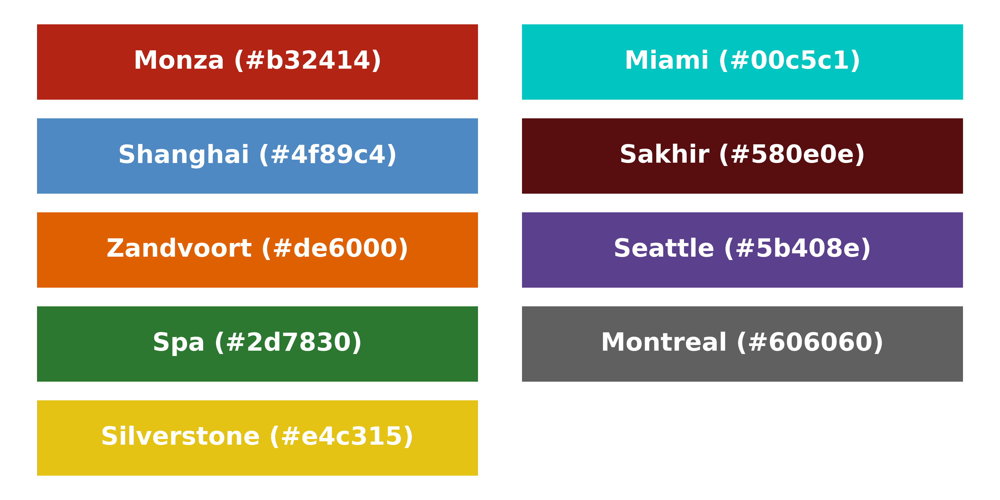
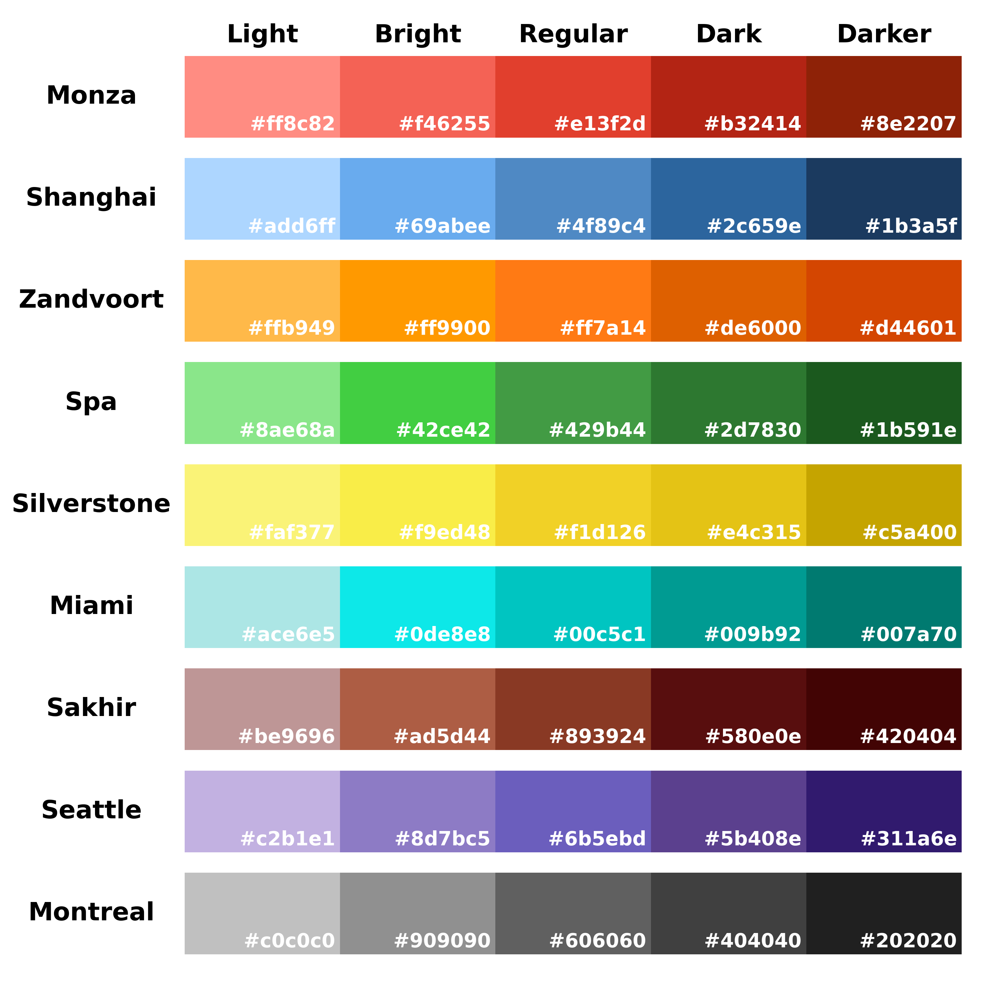

# PlotPalette

PlotPalette is a Python package that simplifies the process of creating colour
palettes for plots. It provides a combination of colours for plots, and a
colour picker to help select the colours.

## Colour Palette

### Main Colours

*Note: To use the main colours, you should use the format of
`{name}` in non-capitalized form (e.g., `monza`).*



| Colour |    Name     |  Value  |
|:------:|:-----------:|:-------:|
|  Red   |    Monza    | #b32414 |
| Orange |  Zandvoort  | #de6000 |
| Yellow | Silverstone | #e4c315 |
| Green  |     Spa     | #2d7830 |
|  Cyan  |    Miami    | #00c5c1 |
|  Blue  |  Shanghai   | #4f89c4 |
| Purple |   Seattle   | #5b408e |
| Brown  |   Sakhir    | #580e0e |
|  Grey  |  Montreal   | #606060 |

### All Colours

*Note: To use these colours, you should use the format of
`{name}-{lightness}` in non-capitalized form (e.g., `monza-regular`).*



| Colour |    Name     |  Light  | Bright  | Regular |  Dark   | Darker  |
|:------:|:-----------:|:-------:|:-------:|:-------:|:-------:|:-------:|
|  Red   |    Monza    | #ff8c82 | #f46255 | #e13f2d | #b32414 | #8e2207 | 
| Orange |  Zandvoort  | #ffb949 | #ff9900 | #ff7a14 | #de6000 | #d44601 | 
| Yellow | Silverstone | #faf377 | #f9ed48 | #f1d126 | #e4c315 | #c5a400 | 
| Green  |     Spa     | #8ae68a | #42ce42 | #429b44 | #2d7830 | #1b591e | 
|  Cyan  |    Miami    | #ace6e5 | #0de8e8 | #00c5c1 | #009b92 | #007a70 | 
|  Blue  |  Shanghai   | #add6ff | #69abee | #4f89c4 | #2c659e | #1b3a5f | 
| Purple |   Seattle   | #c2b1e1 | #8d7bc5 | #6b5ebd | #5b408e | #311a6e | 
| Brown  |   Sakhir    | #be9696 | #ad5d44 | #893924 | #580e0e | #420404 | 
|  Grey  |  Montreal   | #c0c0c0 | #909090 | #606060 | #404040 | #202020 | 

## Installation

### Prerequisites

To install PlotPalette, you need to install python build tools. On Ubuntu,
you can do this by running:

```bash
pip3 install build installer wheel
```

On arch-based systems, you can do this by running:

```bash
sudo pacman -S python-build python-installer python-wheel --needed
```

### Build and Install

Then you can install PlotPalette using pip:

```bash
python -m build --wheel --no-isolation
sudo python -m installer dist/*.whl
```

## Features

- **Colour Palettes**: PlotPalette provides a set of colour palettes that can
  be used in plots, which is given in [colours.py](plotpalette/colours.py).
  You may use the colours in that file directly, or use the colour picker to
  select the colours.
- **Colour Picker**: PlotPalette provides colour picking tools for selecting
  colours for plots. You can use the colour picker to select colours for your
  plots, and then use the colours in your plots.
- **Simpler Plotting** (in progress).
- **Customized Fonts** (in progress).

## License

MIT License

Copyright (c) 2024-2025 Yiyu Liu

Permission is hereby granted, free of charge, to any person obtaining a copy
of this software and associated documentation files (the "Software"), to deal
in the Software without restriction, including without limitation the rights
to use, copy, modify, merge, publish, distribute, sublicense, and/or sell
copies of the Software, and to permit persons to whom the Software is
furnished to do so, subject to the following conditions:

The above copyright notice and this permission notice shall be included in all
copies or substantial portions of the Software.

THE SOFTWARE IS PROVIDED "AS IS", WITHOUT WARRANTY OF ANY KIND, EXPRESS OR
IMPLIED, INCLUDING BUT NOT LIMITED TO THE WARRANTIES OF MERCHANTABILITY,
FITNESS FOR A PARTICULAR PURPOSE AND NONINFRINGEMENT. IN NO EVENT SHALL THE
AUTHORS OR COPYRIGHT HOLDERS BE LIABLE FOR ANY CLAIM, DAMAGES OR OTHER
LIABILITY, WHETHER IN AN ACTION OF CONTRACT, TORT OR OTHERWISE, ARISING FROM,
OUT OF OR IN CONNECTION WITH THE SOFTWARE OR THE USE OR OTHER DEALINGS IN THE
SOFTWARE.
